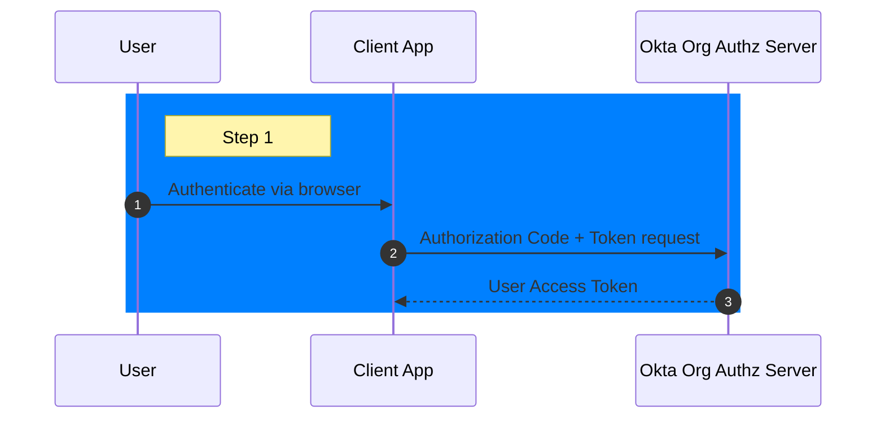
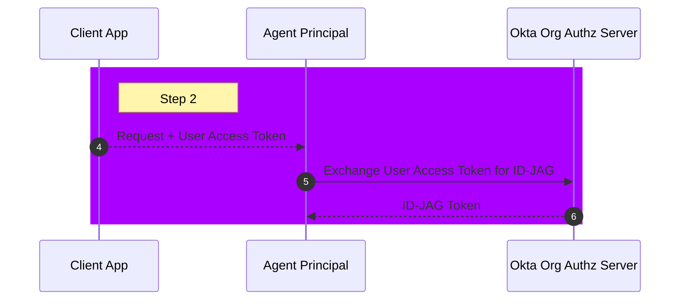
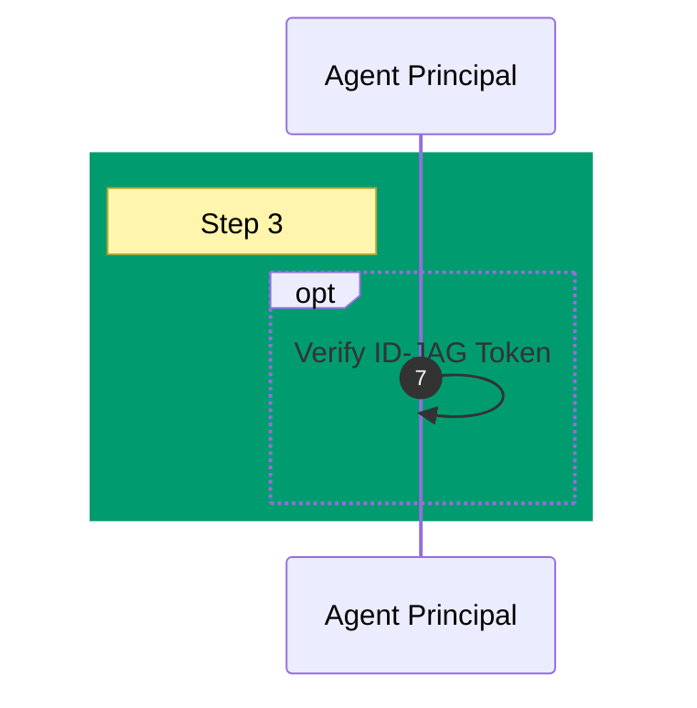
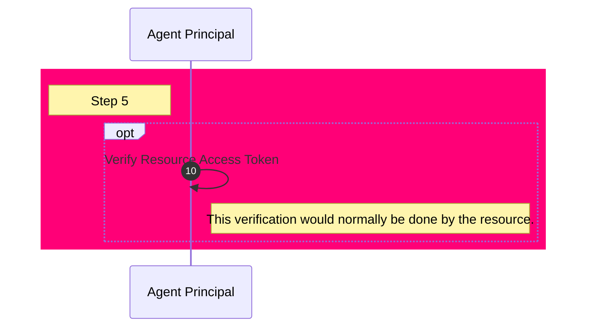

Google Colab does not support directly embedding Mermaid!

The following diagram must be copy/pasted into https://mermaid.live and then you must generate a markdown link.

The following config is recommended:
```json
{
  "theme": "dark",
  "darkMode": true,
  "themeVariables": {
    "background": "#333"
  }
}
```

## Root Diagram

```mermaid
sequenceDiagram
	autonumber
	participant U as User
	participant C as Client App
	participant A as Agent Principal
	participant OAS as Okta Org Authz Server
	participant RAS as Okta Resource Authz Server
	participant R as Resource

	rect rgb(0, 128, 255)
		Note right of U: Step 1
			U->>C: Authenticate via browser
			C->>OAS: Authorization Code + Token request
			OAS-->>C: User Access Token
	end

	rect rgb(170, 0, 255)
		Note right of C: Step 2
			C-->>A: Request + User ID Token
			A->>OAS: Exchange User ID Token for ID-JAG
			OAS-->>A: ID-JAG Token
	end

	rect rgb(0, 156, 112)
		Note left of A: Step 3
		opt
			A->>A: Verify ID-JAG Token
		end
	end

	rect rgb(90, 49, 0)
		Note right of A: Step 4
		A->>RAS: Exchange ID-JAG for Resource Access Token
		RAS-->>A: Resource Access Token
	end

	rect rgb(255, 0, 119)
		Note left of A: Step 5
		opt
			A->>A: Verify Resource Access Token
			Note right of A: This verification would normally be done by the resource.
		end
	end

	rect rgb(38, 73, 109)
		Note right of A: Step 6
		A-->>R: Request to Resource + Access Token
	end
```


## Step 1


## Step 2


## Step 3


## Step 4

```mermaid
sequenceDiagram
    autonumber 8
    participant A as Agent Principal
	participant RAS as Okta Resource Authz Server

	rect rgb(90, 49, 0)
		Note right of A: Step 4
		A->>RAS: Exchange ID-JAG for Resource Access Token
		RAS-->>A: Resource Access Token
	end
```


## Step 5
